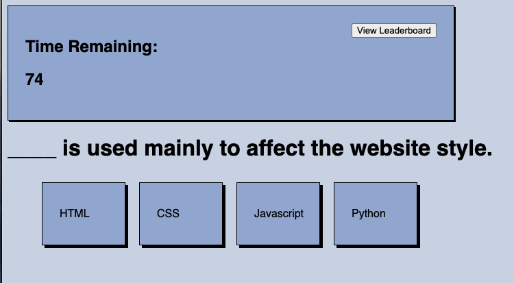

# Script Quiz

## Description
Script Quiz uses html, css, and javascript to create a quiz based on the fundamentals of web development.

## Table of Contents
* [Installation](#installation)
* [Usage](#usage)
* [Credits](#credits)
* [License](#license)

## Installation
Script Quiz will run in any modern browser

## Usage
Click "Start Quiz" to begin the quiz. A timer will begin to count down from 75. A point will be added to the users score for each correct answer. 15 seconds will be removed for each incorrect answer. Upon completion the user will be asked to enter their initials. Once initials are submitted the leaderboard will display the local storage scores.

## Credits
Script Quiz was created by William Mackie
